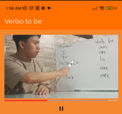
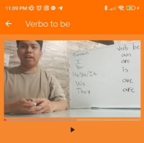

# Bitácora 5
### Avance de **Leonardo Garcia**
Yo documente la parte en la que se presenta el Main de la aplicación. Estuve revisando el código y escribiendo cosas que resultaran muy importantes. De igual forma hice pequeños ajustes dentro de las clases para tener el icono de volver atras cerrando esa ventaja para volver al Main

#### Antes del cambio

#### Despues del cambio

- [Documentación para el HomePage](./componentes/Lecciones/homePage.md)
- [Documentación para la carga y muestreo de clases](./componentes/Lecciones/carga_muestra_leccion.md)
