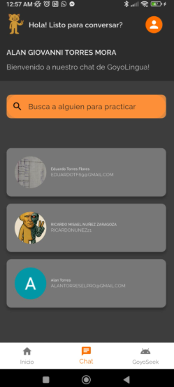

# Bitácora 6
### Avance de **Ricardo Nuñez**
Yo fui el responsabe de documentar cosa por cosa de nuestro código estrella (El chat entre alumnos y profesores).
Primero que nada algo muy importante que mencionar es que antes de tener tu pantalla de chat, antes de eso existe una pantalla de inicio donde se muestran todos los usuarios (dependiendo del rol que seas). Por ejemplo si eres profesor, solo te saldran alumnos, si eres alumno solo te saldran profesores.
Otra cosa importante de esa pantalla es la barra de busqueda, ya que esta permite buscar usuarios en especifico sin distincion de profesores o alumnos, inclusive puedes chatear contigo y te dice quien eres tu
---
## Pantalla de inicio Chat

## Busqueda

- [Documentación del Chat](./componentes/chat_main/chat.md)
