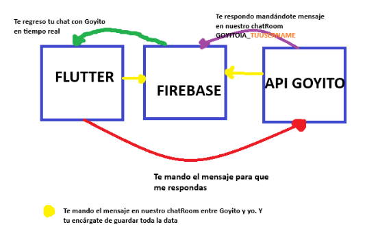

# Documentación del Componente ChatIA de Goyolingua

## Descripción General

El componente `ChatIAPage` es una página de chat que permite a los usuarios interactuar con un asistente de IA llamado "Goyito". La implementación utiliza Flutter para el frontend y Firebase Firestore para la persistencia de mensajes en tiempo real. Las respuestas de la IA son generadas a través de un servicio backend alojado en Render.
Parte importante para nuestro aplicativo ya que esto requiere de una arquitectura un poco diferente para hacer peticiones entre flutter y la API de Goyito

## Arquitectura del Sistema



- **ChatIAPage (Flutter)**: Interfaz de usuario y lógica de la aplicación
- **Firebase (Firestore)**: Almacena y sincroniza mensajes en tiempo real
- **Backend IA (Render)**: Procesa mensajes y genera respuestas de la IA


## Clases Principales

### ChatIAPage

**Parámetros:**
- `name`: Nombre del asistente virtual (Goyito)
- `profileurl`: URL de la imagen de perfil del asistente
- `username`: Nombre de usuario del asistente

### _ChatIAPageState (Estado)

Maneja el estado y la lógica de la página de chat.

**Variables principales:**
- `messageStream`: Stream de mensajes para actualización en tiempo real
- `chatRoomid`: Identificador único de la sala de chat (formato: "GOYITO@IA_[username]")
- `messagecontroller`: Controlador para el campo de texto de mensajes
- `_isLoading`: Bandera para controlar estados de carga durante el envío de mensajes
- `backendUrl`: URL del backend de la IA ("https://goyolinguaapi.onrender.com/api/chat/ask")

## Flujo de Funcionamiento

### Inicialización (initState y ontheload)

1. Al iniciar la página, se invoca `initState()` que llama a `ontheload()`
2. `ontheload()` ejecuta:
   - `getthesharedpref()`: Recupera información del usuario actual desde SharedPreferences
   - `getandSetMessages()`: Configura el stream de mensajes

### Recuperación de Datos de Usuario (getthesharedpref)

```dart
getthesharedpref() async {
  myUsername = await SharedpreferenceHelper.getUserUserName();
  myName = await SharedpreferenceHelper.getUserDisplayName();
  myEmail = await SharedpreferenceHelper.getUserEmail();
  myPicture = await SharedpreferenceHelper.getUserImage();
  myUserId = await SharedpreferenceHelper.getUserId();
  
  // Formato del chatroom: "GOYITO@IA_[username]"
  chatRoomid = "GOYITO@IA_${myUsername}";

  // Configuración del chatroom
  Map<String, dynamic> chatInfoMap = {
    "users": [myUsername, "GOYITO@IA"],
  };
  
  // Crear chatroom si no existe
  if (!await DatabaseMethods().getChatRoom(chatRoomid)) {
    await DatabaseMethods().createChatRoom(chatRoomid!, chatInfoMap);
  }
  
  setState(() {});
}
```
Esta parte es un tanto curiosa, ya que como en el otro chat tenemos una pagina de inicio en la que hay tarjetitas en las que hay información cargada de los datos de ese cierto usuario, nosotros como le estariamos pasando la información de GOYITO, si no es un usuario y es una IA?.
Fácil, en el enrutamiento `navigator.dart` cuando tenemos la parte de la lista de widgets ahí cargamos sus datos.

```dart
final List<Widget> _pantallas = [
    const HomePage(), //Pantalla de ejercicios
    const ChatHomePage(), //pantalla de chats
    ChatIAPage(
        name: "GOYITOIA",
        profileurl:
            "https://firebasestorage.googleapis.com/v0/b/scorplingua.firebasestorage.app/o/Images%2FAssets%2FGoyitoIA.webp?alt=media&token=4ebb747f-05e0-4e6b-a711-d329ed420cac",
        username: "GOYITO@IA")
  ];
```


### Configuración del Stream de Mensajes (getandSetMessages)

```dart
getandSetMessages() async {
  messageStream = await DatabaseMethods().getChatRoomMessages(chatRoomid);
  setState(() {});
}
```
Esta parte es importante ya que aqui podremos establecer los mensajes en tiempo real, esta funcion junto a los shared Preferences deben si o si cargar al inicio de la aplicación.

## Envío y Recepción de Mensajes

### Envío de Mensaje al Backend (sendMessageToBackend)

```dart
Future<void> sendMessageToBackend(String message) async {
  try {
    setState(() {
      _isLoading = true;
    });
    
    // Petición HTTP POST
    final response = await http.post(
      Uri.parse(backendUrl),
      headers: {
        'Content-Type': 'application/json',
      },
      body: json.encode({
        'question': message, 
        'uid': myUserId, 
        'username': myUsername
      }),
    );

    if (response.statusCode != 200) {
      ScaffoldMessenger.of(context).showSnackBar(
        SnackBar(content: Text('Error al comunicarse con la IA')),
      );
    }
  } catch (e) {
    ScaffoldMessenger.of(context).showSnackBar(
      SnackBar(content: Text('Error de conexión')),
    );
  } finally {
    setState(() {
      _isLoading = false;
    });
  }
}
```
Esta pieza de código es clave, es lo que va a definir el mensaje hacia nuestra API, en si necesitamos de la URL de la API, segundo necesitamos del verbo http que este de acuerdo con el endpoint de la API (en este caso POST). Los headers le pasamos que tipo de informacion que va a ser. Y el body es importante pasar la pregunta, el user ID y el username. El user id Es super importante ya que con este primero pasaremos en el backend un middleware que comprueba si existe el usuario o no. Posteriormente lo va a almacenar localmente para que exista un control de mensajes por usuario (Máximo 10 por día).

### Añadir Mensaje (addMessage)

```dart
addMessage(bool sendClicked) async {
  if (!_isLoading && messagecontroller.text != "") {
    String message = messagecontroller.text;
    messagecontroller.text = "";
    DateTime now = DateTime.now();
    String formattedDate = DateFormat('h:mma').format(now);

    // Información del mensaje
    Map<String, dynamic> messageInfoMap = {
      "Data": "Message",
      "message": message,
      "sendBy": myUsername,
      "ts": formattedDate,
      "time": FieldValue.serverTimestamp(),
      "imgUrl": myPicture
    };

    messageId = randomAlphaNumeric(10); //Id unico generado por nosotros en el front

    // Guardar mensaje en Firebase
    await DatabaseMethods().addMessage(chatRoomid!, messageId!, messageInfoMap);

    // Enviar al backend para respuesta de la IA
    await sendMessageToBackend(message);
  }
}
```

## Componentes de UI

### Visualización de Mensajes (chatMessage)

El método `chatMessage()` utiliza un `StreamBuilder` para mostrar mensajes en tiempo real:

```dart
Widget chatMessage() {
  return StreamBuilder(
    stream: messageStream,
    builder: (context, AsyncSnapshot snapshot) {
      return snapshot.hasData
        ? ListView.builder(
            padding: EdgeInsets.only(bottom: 70),
            itemCount: snapshot.data.docs.length,
            reverse: true,
            itemBuilder: (context, index) {
              DocumentSnapshot ds = snapshot.data.docs[index];
              bool isSentByMe = myUsername == ds["sendBy"];
              return chatMessageTile(context, ds, isSentByMe);
            })
        : Center(child: CircularProgressIndicator());
    });
}
```

### Tiles de Mensaje (chatMessageTile)

El método `chatMessageTile()` renderiza cada mensaje con un formato específico según quién lo envió:

```dart
Widget chatMessageTile(BuildContext context, dynamic data, bool sendByMe) {
  double screenWidth = MediaQuery.of(context).size.width;

  return Row(
    mainAxisAlignment: sendByMe ? MainAxisAlignment.end : MainAxisAlignment.start,
    children: [
      Flexible(
        child: Container(
          padding: EdgeInsets.all(16),
          margin: EdgeInsets.symmetric(horizontal: 16, vertical: 4),
          decoration: BoxDecoration(
            borderRadius: BorderRadius.only(
              topLeft: Radius.circular(24),
              bottomRight: sendByMe ? Radius.circular(0) : Radius.circular(24),
              topRight: Radius.circular(24),
              bottomLeft: sendByMe ? Radius.circular(24) : Radius.circular(0)
            ),
            color: sendByMe
              ? Theme.of(context).colorScheme.secondary
              : Theme.of(context).colorScheme.onSecondary
          ),
          child: Text(
            data["message"],
            style: TextStyle(
              color: Colors.white,
              fontSize: screenWidth * 0.035,
              fontWeight: FontWeight.w600
            ),
          ),
        )
      )
    ],
  );
}
```

### UI Principal (build)

La estructura general de la interfaz incluye:
1. Encabezado con foto de perfil y nombre de Goyito
2. Área de mensajes (expandible)
3. Área de entrada de texto con botón de envío

