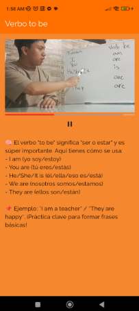

# Documentación de `CargaLeccion` y `MuestraTeoria`

## Archivo: `CargaLeccion.dart`

## Imagenes

### Descripción
`CargaLeccion` es un widget de tipo `StatelessWidget` cuya función es cargar una lección específica desde la base de datos y mostrarla usando el widget `MuestraTeoria`. Utiliza `FutureBuilder` para manejar el estado asincrónico de la carga de datos.

### Props

- `claseId`: `String` (obligatorio) — El ID de la lección a recuperar desde la base de datos.

### Métodos

#### `Future<Leccion> obtenerLec(String id)`
Función asincrónica que obtiene los datos de una lección específica usando el servicio `DatabaseMethods().obtenerLeccion(id)`.

### UI y flujo

1. Se construye un `FutureBuilder<Leccion>` con el resultado de `obtenerLec(claseId)`.
2. Si la conexión está en espera, muestra un indicador de carga (`CircularProgressIndicator`).
3. Si ocurre un error, muestra un mensaje de error.
4. Si se recuperan correctamente los datos de la lección, se muestra el widget `MuestraTeoria` pasando los atributos de la lección.
5. Si no hay datos, muestra un mensaje informativo.

---

## Archivo: `MuestraTeoria.dart`

### Descripción
`MuestraTeoria` es un widget de tipo `StatelessWidget` que presenta los datos de una lección: el título, el texto, un video y una imagen si están disponibles.

### Props

- `nombreLeccion`: `String` — Título de la lección.
- `texto`: `String` — Contenido textual de la lección.
- `videoUrl`: `String?` — URL del video explicativo de la lección (opcional).
- `imagenUrl`: `String?` — URL de una imagen asociada con la lección (opcional).

### UI y lógica

1. Utiliza un `Scaffold` con `AppBar` que muestra el nombre de la lección.
2. Usa un `SingleChildScrollView` para permitir desplazamiento vertical en caso de contenido largo.
3. Si `videoUrl` no es nulo ni vacío, se muestra un `VideoPlayerWidget`.
4. Se muestra el texto con un tamaño de fuente de 16.
5. Si `imagenUrl` no es nulo ni vacío, se muestra la imagen desde la red (`Image.network`).

### Dependencias

- `VideoPlayerWidget`: Componente personalizado que se encarga de renderizar el video desde la URL dada.

---

### VideoPlayerWidget
Este es un widget que conseguimos de la documentación oficial de (https://pub.dev/packages/video_player)
Basicamente de un video que tenemos referenciado dentro de nuestra base de datos lo vamos a cargar y en base a las dimenciones de este se comprobara si viene en formato vertical u horizontal. Toma la decision en base a la medida más grande y muestra en ese formato.
Solamente le pasamos como argumento el link del video que queremos cargar

## Flujo General

- `CargaLeccion` recibe un ID de clase y consulta la base de datos.
- Una vez cargada la información, se presenta en `MuestraTeoria`, que organiza visualmente el contenido de la lección para el usuario.
