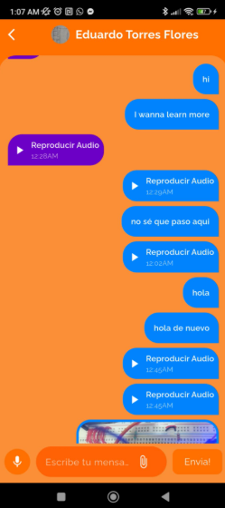
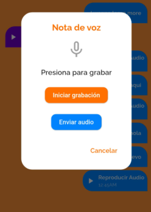
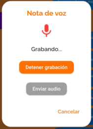
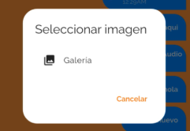
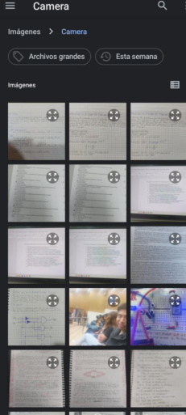
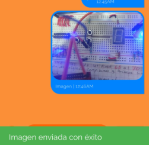

# ChatPage - Documentación de Aplicación de Chat en Flutter

## Descripción General

Este es un caso especial, fue un código complicado de escalar, ya que seguimos un tutorial en youtube por desconocimiento de muchos temas que hacen posible crear esta pagina de flutter.
El video del que tomamos por referencia es este
[Ultimate Chat App with Flutter Firebase | Full Tutorial for Beginners 2025](https://www.youtube.com/watch?v=TWUeE6kz3Lo&t=12114s&ab_channel=ShivamGupta)
Este codigo es muy complicado de escalar si no entendemos los conceptos de como crear y gestionar servicios. Esta fue una solución que optamos, pero no nos salio y mejor decidimos dejar lo que vimos en el video, recortar algunas cosas y crear algunas nosotros
## Tabla de Contenidos

1. [Estructura de Clases](#estructura-de-clases)
2. [Variables de Estado](#variables-de-estado)
3. [Funciones de Inicialización](#funciones-de-inicialización)
4. [Funcionalidad de Grabación de Audio](#funcionalidad-de-grabación-de-audio)
5. [Selección y Carga de Imágenes](#selección-y-carga-de-imágenes)
6. [Visualización y Renderizado de Mensajes](#visualización-y-renderizado-de-mensajes)
7. [Reproducción de Audio](#reproducción-de-audio)
8. [Manejo de Mensajes](#manejo-de-mensajes)

## Estructura de Clases

### ChatPage

Un widget con estado que representa la interfaz principal de chat.

```dart
class ChatPage extends StatefulWidget {
  String name, profileurl, username;
  ChatPage({required this.name, required this.profileurl, required this.username});
  @override
  State<ChatPage> createState() => _ChatPageState();
}
```

**Parámetros:**
- `name`: Nombre de visualización del destinatario del chat
- `profileurl`: URL de la imagen de perfil del destinatario
- `username`: Nombre de usuario del destinatario

### _ChatPageState

La clase de estado que gestiona la funcionalidad y la interfaz de usuario del chat.

### Imagen de la pantalla de Chat


## Variables

La clase utiliza varias variables para gestionar el estado del chat:

- **UI y Datos del Chat:**
  - `messageStream`: Stream para cargar mensajes en tiempo real
  - `myUsername`, `myName`, `myEmail`, `myPicture`: Detalles del usuario actual
  - `chatRoomid`: Identificador único para esta conversación de chat
  - `messageId`: Identificador único para cada mensaje
  - `selectedImage`: Objeto File para imágenes seleccionadas
  - `messagecontroller`: Controlador de entrada de texto

- **Variables del Reproductor de Audio:**
  - `_audioPlayer`: Instancia de AudioPlayer
  - `_currentlyPlayingUrl`: URL del audio que se está reproduciendo actualmente
  - `_isPlaying`: Indicador de si el audio se está reproduciendo
  - `_isRecording`: Indicador de si se está grabando audio
  - `_filePath`: Ruta al archivo de audio grabado
  - `_recorder`: Instancia de FlutterSoundRecorder
  - `_recorderInitialized`: Indicador de si el grabador está inicializado

## Funciones de Inicialización

### getthesharedpref()

Recupera datos de usuario de SharedPreferences:
```dart
getthesharedpref() async {
  myUsername = await SharedpreferenceHelper.getUserUserName();
  myName = await SharedpreferenceHelper.getUserDisplayName();
  myEmail = await SharedpreferenceHelper.getUserEmail();
  myPicture = await SharedpreferenceHelper.getUserImage();
  chatRoomid = ChatUtils.getChatRoomIdByUsername(myUsername!, widget.username);
  setState(() {});
}
```

### getandSetMessages()

Recupera mensajes de chat para la sala de chat actual:
```dart
getandSetMessages() async {
  messageStream = await DatabaseMethods().getChatRoomMessages(chatRoomid);
  setState(() {});
}
```

### ontheload()

Llamado en la inicialización para cargar elementos esenciales:
```dart
ontheload() async {
  await getthesharedpref();
  await getandSetMessages();
}
```

### initState() y dispose()

- **initState()**: Inicializa el componente, carga datos y configura los oyentes de eventos del reproductor de audio
- **dispose()**: Libera recursos para el grabador y reproductor de audio

## Funcionalidad de Grabación de Audio

#### Imagenes




### Gestión de Permisos

- `_initialize()`: Configura el grabador de audio y solicita permisos
- `_requestPermission()`: Solicita permisos de micrófono y almacenamiento

### Controles de Grabación

- `openRecording()`: Muestra un diálogo para grabar notas de audio
- `_startRecording()`: Inicia la grabación de audio
- `_stopRecording()`: Detiene la grabación de audio
- `_uploadFile()`: Sube el audio grabado a Firebase Storage

### Interfaz de Usuario del Diálogo de Audio

El diálogo proporciona:
- Indicador de estado de grabación
- Botón de inicio/parada de grabación
- Botón de carga para enviar audio grabado
- Botón de cancelar

## Selección y Carga de Imágenes

#### Imagenes




### Selección de Imágenes

- `getImage()`: Muestra diálogo para seleccionar imagen de la galería
- `_getImageFromGallery()`: Recupera imagen de la galería del dispositivo

### Carga de Imágenes

- `_uploadImage()`: Sube la imagen seleccionada a Firebase Storage y crea una entrada de mensaje

## Visualización y Renderizado de Mensajes

### chatMessageTile()

Renderiza mosaicos de mensajes individuales según el tipo de mensaje (texto, imagen o audio):

```dart
Widget chatMessageTile(BuildContext context, dynamic data, bool sendByMe) {
  // Renderizado diferente para mensajes de texto, imagen y audio
  // Utiliza diseño responsive con MediaQuery
}
```

Características clave:
- Diferentes estilos para mensajes enviados vs. recibidos
- Renderizado especializado para mensajes de texto, imágenes y audio
- Diseño responsive utilizando MediaQuery para dimensionamiento según la pantalla

### chatMessage()

Renderiza toda la lista de mensajes:

```dart
Widget chatMessage() {
  return StreamBuilder(
    stream: messageStream,
    builder: (context, AsyncSnapshot snapshot) {
      return snapshot.hasData
        ? ListView.builder(...)
        : Center(child: CircularProgressIndicator());
    }
  );
}
```

## Reproducción de Audio

Gestiona la reproducción de audio con las siguientes características:

### _playAudio()

```dart
Future<void> _playAudio(String audioUrl) async {
  // Lógica para reproducir, pausar y cambiar archivos de audio
}
```

Funcionalidad:
- Pausar/reanudar audio actual
- Detener reproducción al cambiar a un archivo de audio diferente
- Restablecer posición de audio al reproducir el mismo archivo
- Manejo automático de estado cuando se completa la reproducción de audio

## Manejo de Mensajes

### addMessage()

Añade un nuevo mensaje de texto al chat:

```dart
addMessage(bool sendClicked) async {
  if (messagecontroller.text != "") {
    // Crear objeto de mensaje con texto y metadatos
    // Generar ID único y almacenar en Firebase
  }
}
```

## Almacenamiento de Datos

La aplicación utiliza:
- **Firebase Firestore**: Para almacenar mensajes de chat y metadatos
- **Firebase Storage**: Para almacenar archivos multimedia (imágenes y audio)
- **SharedPreferences**: Para almacenar datos de usuario locales

## Características de la Interfaz de Usuario

- **Diseño Responsive**: Se adapta a diferentes tamaños de pantalla
- **Burbujas de Mensajes**: Diferentes estilos para mensajes enviados vs. recibidos
- **Manejo de Medios**: Soporte para texto, imágenes y audio
- **Indicadores de Carga**: Indicadores de progreso para carga de medios
- **Marcas de Tiempo**: Formato de tiempo para mensajes

## Dependencias

La aplicación utiliza varios paquetes de Flutter:
- `flutter_sound`: Para grabación de audio
- `just_audio`: Para reproducción de audio
- `image_picker`: Para seleccionar imágenes
- `firebase_storage`: Para almacenar archivos multimedia
- `cloud_firestore`: Para almacenar mensajes de chat
- `intl`: Para formateo de fechas
- `permission_handler`: Para gestionar permisos
- `path_provider`: Para acceder al almacenamiento del dispositivo
- `random_string`: Para generar IDs únicos
