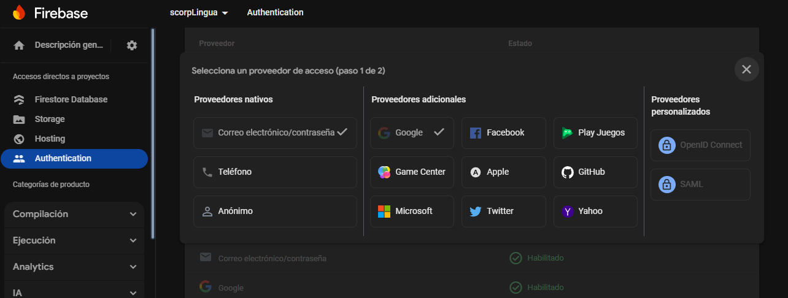
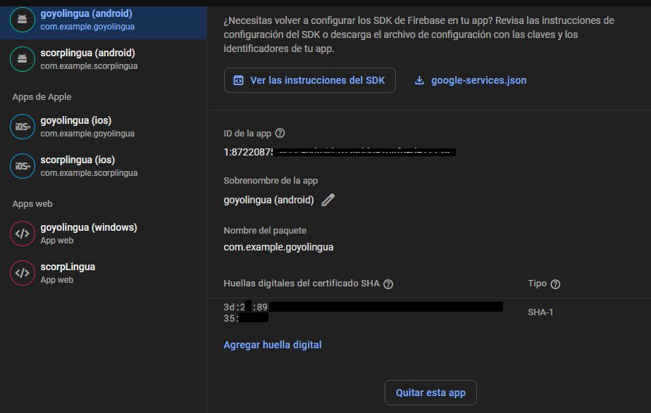
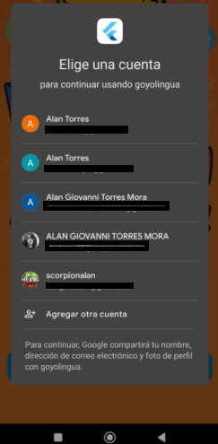

# Documentación de Autenticación y Onboarding en Goyolingua

## Página de Onboarding 🚀

Esta es nuestra pagina de bienvenida, donde haremos uso de muchas herramientas para lograr autenticar, guardar estados globales, navegar entre rutas y mas cosas. Tan solo con un solo boton que dice iniciar sesión.


#### Lo que muestra la página:

- **Una imagen grande**: Ocupa el 65% superior de la pantalla, mostrando el logo de GoyoLingua.
- **Un mensaje motivacional**: Le dice al usuario (que tiene que ser universitario de nuestra facultad) que puede disfrutar aprendiendo inglés.
- **Un botón de inicio de sesión con Google**: Cuando el usuario lo presiona, llama a la función `signInWithGoogle` de nuestra clase `AuthMethods`.


```dart
SizedBox(
  width: double.infinity,
  height: 50,
  child: ElevatedButton(
    onPressed: () {
      AuthMethods().signInWithGoogle(context);
    },
    child: const Text("¡Inicia sesión con Google!"),
  ),
),
```

#### Un detalle interesante:

Hacemos uso de los `MediaQuery` para obtener las dimensiones de la pantalla y hacer que nuestra interfaz sea responsiva. Así se adapta a diferentes tamaños de dispositivos:

```dart
final screenHeight = MediaQuery.of(context).size.height;
final screenWidth = MediaQuery.of(context).size.width;
```


## Sistema de Autenticación 🔐

La clase `AuthMethods` es de lo más importante para nuestro aplicativo, ya que con esto vamos a poder tener un login seguro.

Antes de continuar con el código es importante identificar que tipo de login vamos a usar, ya que existen diferentes proveedores que nos permitiran el acceso si los definimos en el Auth de Firebase



En un inicio hicimos pruebas con el correo electronico/ contraseña y validando el correo con autenticacion por mensaje a ese correo, sin embargo, resulta un poco más dificil manejar los tokens de firebase ya que son más volatiles. Por lo que optamos a usar autenticación con Google para tener un token estatico de autenticación y poder usarlo para manejarlo en nuestro estado global.

Pero para lograr la autenticación de google, te piden si o si una huella, la cual es un SHA 256 que debes de generar con el equipo con el que estas desarrollando. Este se puede obtener siguiendo la documentación correspondiente y una vez hecho y configurado en el firebase, debemos de volver a descargar el json de los servicios de google y actualizar los que vienen del apartado de la APP


Una vez definido lo anterior continuaremos con la parte de la aplicacion de flutter

```dart
import 'package:goyolingua/core/Services/auth.dart';
```

### ¿Qué hace esta clase?

#### 1. Conexión con Firebase 🔥

Lo primero que hace es establecer la conexión con Firebase Auth:

```dart
final FirebaseAuth auth = FirebaseAuth.instance;
```

#### 2. Obtener el usuario actual

Tiene una función simple para obtener el usuario actual:

```dart
getCurrentUser() async {
  return await auth.currentUser;
}
```

#### 3. Inicio de sesión con Google 📱

La función más importante es `signInWithGoogle()`. Esta es la que se llama cuando presionamos el botón de inicio de sesión. Hace todo el proceso de autenticación con Google:

```dart
signInWithGoogle(BuildContext context) async {
  final GoogleSignIn googleSignIn = GoogleSignIn();
  
  // Inicia el proceso de inicio de sesión de Google
  final GoogleSignInAccount? googleSignInAccount = await googleSignIn.signIn();
  if (googleSignInAccount == null) return; // El usuario canceló
```

Cuando llamamos a `googleSignIn.signIn()`, aparece la ventana típica de selección de cuenta de Google.


Si el usuario elige una cuenta, recibimos la información de esa cuenta y obtenemos las credenciales:

```dart
final GoogleSignInAuthentication googleAuth = await googleSignInAccount.authentication;

final AuthCredential credential = GoogleAuthProvider.credential(
  idToken: googleAuth.idToken,
  accessToken: googleAuth.accessToken,
);
```

Luego usamos esas credenciales para iniciar sesión en Firebase:

```dart
UserCredential result = await auth.signInWithCredential(credential);
User? userDetails = result.user;
```

#### 4. Validación de dominio (comentada) 📧

Hay una sección comentada que verificaría si el correo termina con `@aragon.unam.mx`. Esto es para restringir la app solo a nuestros estudiantes de la FES Aragón:

```dart
// final isAragon = email.endsWith("@aragon.unam.mx");
// if (!isAragon) {
//   await auth.signOut();
//   ...
// }
```

Cuando estemos listos para la versión final, podríamos descomentar esto para que solo los estudiantes puedan usar la app.

#### 5. Flujo de usuarios nuevos vs existentes 👥

Aquí viene lo interesante. La app verifica si el usuario ya existe en Firestore:

```dart
final userDoc = await DatabaseMethods().getUserById(uid);

if (userDoc.exists) {
  // Usuario ya registrado
  ...
} else {
  // Usuario nuevo
  ...
}
```

Si el usuario ya existe, simplemente:
1. Recupera sus datos de Firestore
2. Los guarda localmente usando `SharedpreferenceHelper`
3. Lo redirige a la pantalla principal (`Navegador`)

Si es un usuario nuevo:
1. Lo redirige a `CompleteProfileScreen` para que complete su perfil
2. Guarda la información adicional que proporciona
3. Sube su imagen de perfil (si eligió una) a Firebase Storage
4. Guarda todos los datos localmente
5. Crea un nuevo documento en Firestore con toda la información
6. Finalmente lo redirige a la pantalla principal

### Datos del usuario 📝

Cuando guardamos un usuario en Firestore, almacenamos varios datos importantes:

```dart
Map<String, dynamic> userInfoMap = {
  "name": userDetails.displayName,
  "username": username.toUpperCase(),
  "email": email,
  "Image": imageUrl ?? userDetails.photoURL,
  "Id": userDetails.uid,
  "createdAt": userDetails.metadata.creationTime,
  "SearchKey": firstLetter,
  "idiomaAprender": userExtraData["idiomaAprender"],
  "idiomaOrigen": userExtraData["idiomaOrigen"],
  "eresMaestro": userExtraData["eresMaestro"],
  "sexo": userExtraData["sexo"]
};
```

Este objeto contiene toda la información necesaria para el perfil del usuario:
- Datos básicos como nombre y correo
- Preferencias de idioma (el que habla y el que quiere aprender)
- Si es estudiante o maestro
- Su sexo
- Una clave de búsqueda (para buscar usuarios fácilmente)

## ¿Cómo se conectan estas clases? 🔄

Todo empieza en `Onboarding`. Cuando el usuario presiona el botón de inicio de sesión con Google, se llama a `AuthMethods().signInWithGoogle(context)`. Esta función:

1. Maneja todo el proceso de autenticación con Google y Firebase
2. Verifica si el usuario ya existe o es nuevo
3. Guarda los datos relevantes del usuario
4. Redirige al usuario a la pantalla principal

Cuando un usuario cierra sesión (como vimos en la clase `ProfilePage`), es redirigido de vuelta a `Onboarding` para que pueda iniciar sesión nuevamente.

## Conceptos importantes que usamos 🧠

- **Firebase Authentication**: Sistema que maneja la autenticación de usuarios
- **Google Sign-In**: API que nos permite usar cuentas de Google para iniciar sesión
- **Firestore**: Base de datos donde guardamos toda la información de los usuarios
- **SharedPreferences**: Sistema para guardar datos localmente en el dispositivo
- **Navigator**: Sistema de navegación de Flutter para movernos entre pantallas

# SharedpreferenceHelper: Gestión de Estado Global


`SharedpreferenceHelper` es una clase que implementa un patrón de gestión de estado global para la aplicación Goyolingua mediante el uso de SharedPreferences, un mecanismo de persistencia local de clave-valor.

## Características Principales

### Constantes de Claves
```dart
static const String userIdKey = "USERKEY";
static const String userNameKey = "USERNAMEKEY";
// ... otras claves definidas
```
Son nuestros identificadores unicos en los que vamos a guardar los valores correspondientes

### Métodos Setter (No estáticos)
```dart
Future<bool> saveUserId(String value) async {
  final prefs = await SharedPreferences.getInstance();
  return prefs.setString(userIdKey, value);
}
// ... otros métodos setter
```
Son metodos que nos van a permitir mediante una promesa salvar valores como los que por ejemplo al iniciar sesion o crear una cuenta vamos a guardar.

### Métodos Getter (Estáticos)
```dart
static Future<String?> getUserId() async {
  final prefs = await SharedPreferences.getInstance();
  return prefs.getString(userIdKey);
}
// ... otros métodos getter
```
Proporciona acceso asíncrono a los datos del usuario desde cualquier parte de la aplicación sin necesidad de instanciar la clase. Da una ventaja ya que este tipo de metodos estaticos al no instanciarlos directamente vamos a obtener el valor de forma inmediata

### Gestión de Sesión
```dart
Future<bool> clearUserData() async {
  final prefs = await SharedPreferences.getInstance();
  try {
    // Elimina todos los datos de usuario
    // ...
    return true;
  } catch (e) {
    return false;
  }
}
```
Esto es para totalmente eliminar los datos del dispositivo una vez cerramos sesión

## Aplicaciones en la App

Este helper es fundamental para:

1. **Acceso offline a datos de usuario**: Permite que la app funcione sin necesidad de conexión constante a Firebase
2. **Mejora de rendimiento**: Evita consultas innecesarias a la base de datos remota
3. **Persistencia entre sesiones**: Mantiene el estado de login hasta que el usuario cierra sesión explícitamente
4. **Verificación de autenticación**: Facilita la comprobación del estado de autenticación actual


