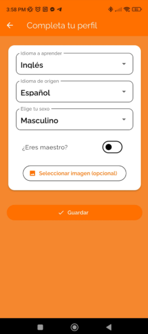

# CompleteProfileScreen: Completar información con un formulario!

## Descripción General
Este es un widget que se presenta a los usuarios nuevos después de autenticarse. Permite recopilar información adicional necesaria para completar el perfil del usuario, como preferencias de idioma, rol y foto de perfil.



## Características Técnicas

### Inicialización y Estado
```dart
class _CompleteProfileScreenState extends State<CompleteProfileScreen> {
  String idiomaAprender = 'Inglés';
  String idiomaOrigen = 'Español';
  bool eresMaestro = false;
  File? imagenSeleccionada;
  String sexo = "Masculino";
  final ImagePicker _picker = ImagePicker();
}
```
El estado mantiene los valores predeterminados para cada campo del formulario y una instancia de `ImagePicker` para gestionar la selección de imágenes. Con el fin de que cargue los primeros deatos de los componentes

### Funciones Principales

#### Selección de Imagen
```dart
void pickImage() async {
  final pickedFile = await _picker.pickImage(source: ImageSource.gallery);
  if (pickedFile != null) {
    setState(() {
      imagenSeleccionada = File(pickedFile.path);
    });
  }
}
```
Permite al usuario seleccionar una imagen de perfil desde la galería del dispositivo. Esta sección de codigo fue obtenida de la documentación oficial

#### Guardar Información
```dart
void guardarInformacion() {
  final datosFinales = {
    "idiomaAprender": idiomaAprender,
    "idiomaOrigen": idiomaOrigen,
    "eresMaestro": eresMaestro,
    "sexo": sexo,
    "imagen": imagenSeleccionada?.path,
  };

  Navigator.pop(context, datosFinales);
}
```
Función callback que recopila los datos ingresados y los devuelve a la pantalla anterior (AuthMethods) para completar el registro.

### Interfaz de Usuario

La pantalla implementa varios componentes de formulario:

1. **DropdownButtonFormField**: Tres selectores para idioma a aprender, idioma de origen y sexo.
   ```dart
   DropdownButtonFormField<String>(
     value: idiomaAprender,
     decoration: const InputDecoration(labelText: "Idioma a aprender"),
     items: const ["Inglés"].map((lang) {
       return DropdownMenuItem(value: lang, child: Text(lang));
     }).toList(),
     onChanged: (value) => setState(() {
       idiomaAprender = value!;
     }),
   )
   ```

2. **SwitchListTile.adaptive**: Un interruptor que se adapta a la plataforma para indicar si el usuario es maestro. El adaptive investigando resulta que adapta este componente para distintas plataformas (ios y android). Lo cual no es muy importante en este proyecto, pero ahí esta el dato curioso
   ```dart
   SwitchListTile.adaptive(
     title: const Text("¿Eres maestro?"),
     value: eresMaestro,
     onChanged: (value) => setState(() {
       eresMaestro = value;
     }),
   )
   ```

3. **Selector de Imagen**: Botón que activa el `ImagePicker` y muestra una vista previa condicionalmente.
   ```dart
   if (imagenSeleccionada != null)
     Padding(
       padding: const EdgeInsets.only(top: 16),
       child: ClipRRect(
         borderRadius: BorderRadius.circular(12),
         child: Image.file(imagenSeleccionada!, height: 120),
       ),
     )
   ```

4. **Botón de Guardar**: Acción principal que envía los datos recopilados.
   ```dart
   FilledButton.icon(
     icon: const Icon(Icons.check),
     label: const Text("Guardar"),
     onPressed: guardarInformacion,
   )
   ```

## Integración con la Aplicación

Este formulario funciona como una pantalla intermedia en el flujo de registro. Cuando un usuario nuevo se autentica mediante Google en `AuthMethods`, es redirigido a esta pantalla para completar su perfil antes de acceder a la aplicación principal.

El resultado del formulario se devuelve a `AuthMethods`, donde se utiliza para:
1. Guardar la información en Firebase Firestore
2. Establecer valores en SharedPreferences
3. Completar el proceso de registro del usuario

## Aspectos Técnicos Destacables

- Utiliza `Navigator.pop(context, data)` para devolver datos como resultado
- Implementa renderizado condicional para la vista previa de la imagen
- Gestiona la selección de archivos mediante ImagePicker
- Proporciona valores predeterminados para todos los campos requeridos
