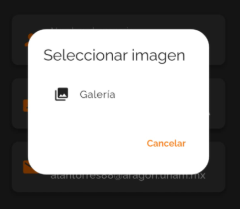
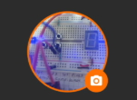
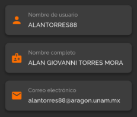
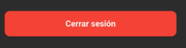
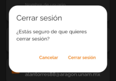

# Documentación de ProfilePage

## Descripción General
`ProfilePage` es un widget que muestra y permite gestionar la información del perfil de un usuario en la aplicación Goyolingua. Esta pagina esta encargada de cargar los datos del usuario como su imagen, su foto (con la opcion de poderla cambiar).
Y finalmente un boton de cerrar sesión

## Importaciones Principales
```dart
import 'dart:io';
import 'package:firebase_auth/firebase_auth.dart';
import 'package:firebase_storage/firebase_storage.dart';
import 'package:flutter/material.dart';
import 'package:google_sign_in/google_sign_in.dart';
import 'package:image_picker/image_picker.dart';
```

## Estructura del Widget

### Estado y Variables
- `myUsername`: nombre de usuario actual
- `myName`: nombre completo del usuario
- `myEmail`: correo electrónico del usuario
- `myPicture`: URL de la imagen de perfil
- `selectedImage`: archivo de imagen seleccionado temporalmente
- `_isLoading`: indicador de estado de carga para operaciones asíncronas

## Funciones Principales

### `initState()`
- Inicializa el widget y llama a `_loadUserData()` para cargar los datos del usuario.

### `_loadUserData()`
```dart
Future<void> _loadUserData() async {
  myUsername = await SharedpreferenceHelper.getUserUserName();
  myName = await SharedpreferenceHelper.getUserDisplayName();
  myEmail = await SharedpreferenceHelper.getUserEmail();
  myPicture = await SharedpreferenceHelper.getUserImage();
  setState(() {});
}
```
- Recupera la información del usuario desde `SharedpreferenceHelper`.
- Actualiza el estado para reflejar los datos obtenidos.

### `_changeProfilePicture()`
- Muestra un diálogo que permite al usuario seleccionar una imagen desde la galería.
- Utiliza el widget `_buildImageOption()` para crear las opciones de selección.



### `_buildImageOption()`
```dart
ListTile _buildImageOption(IconData icon, String title, ImageSource source) {
  // Crea una opción en el diálogo para seleccionar una imagen
  // Cuando se selecciona, llama a _uploadAndSaveProfilePicture()
}
```
- Crea una opción en el diálogo para elegir la fuente de la imagen.
- Al seleccionar una opción, abre el selector de imágenes y procesa la imagen elegida.

### `_uploadAndSaveProfilePicture()`
```dart
Future<void> _uploadAndSaveProfilePicture(File imageFile) async {
  // Sube la imagen a Firebase Storage
  // Actualiza la URL de la imagen en la base de datos y en SharedPreferences
}
```
- Sube la imagen seleccionada a Firebase Storage.
- Guarda la URL de la imagen en la base de datos y en SharedPreferences.
- Muestra notificaciones sobre el éxito o fracaso de la operación.

### `_signOut()`
```dart
Future<void> _signOut() async {
  // Desconecta la cuenta de Google
  // Cierra la sesión de Firebase
  // Limpia los datos locales
  // Redirige a la pantalla de onboarding
}
```
- Gestiona el proceso completo de cierre de sesión.
- Desconecta la cuenta de Google y cierra la sesión en Firebase.
- Limpia los datos del usuario almacenados localmente.
- Redirige al usuario a la pantalla de onboarding.

## Widgets de la Interfaz

### `build()`
- Construye la estructura principal de la página con un `Scaffold`.
- Organiza los componentes en un `Stack` para poder mostrar un indicador de carga.

### `_buildProfileImage()`
```dart
Widget _buildProfileImage(double screenWidth) {
  // Muestra la imagen de perfil en un círculo con borde
  // Incluye un botón para cambiar la imagen
}
```

- Muestra la imagen de perfil del usuario en un contenedor circular.
- Añade un botón de cámara que permite cambiar la imagen de perfil.
- Gestiona estados de carga durante la visualización de la imagen.

### `_buildProfileItem()`
```dart
Widget _buildProfileItem(IconData icon, String title, String value) {
  // Crea un contenedor para mostrar información del perfil
  // Incluye un icono, título y valor
}
```

- Crea un elemento visual para mostrar información del perfil.
- Muestra un icono, título y valor en un contenedor estilizado.
- En este caso va a mostrar 3 elementos (Nombre de usuario, Nombre completo y correo electronico)

### `_buildSignOutButton()`
```dart
Widget _buildSignOutButton() {
  // Crea un botón para cerrar sesión
  // Muestra un diálogo de confirmación cuando se presiona
}
```




- Crea un botón de cierre de sesión con estilo visual distintivo.
- Muestra un dialogo de confirmación antes de proceder al cierre de sesión.
- Una vez confirmado redirige a la pagina principal vaciando todo el contenido

## Flujo de Navegación
1. El usuario accede a la página de perfil.
2. La página carga automáticamente los datos del usuario desde SharedPreferences.
3. El usuario puede:
   - Ver su información personal.
   - Cambiar su imagen de perfil seleccionando una imagen desde la galería.
   - Cerrar sesión, lo que le redirige a la pantalla de onboarding.

## Integración con Firebase
- Utiliza Firebase Authentication para gestionar la sesión del usuario.
- Emplea Firebase Storage para almacenar y recuperar imágenes de perfil.
- Integra Google Sign-In para la autenticación con cuentas de Google.

## Gestión de Estado
- Utiliza `setState()` para actualizar la interfaz cuando cambian los datos.
- Emplea `_isLoading` para mostrar indicadores visuales durante operaciones asíncronas.
- Controla el estado de montaje del widget (`mounted`) para evitar actualizar widgets desmontados.

## Manejo de Errores
- Implementa bloques try-catch para capturar y gestionar errores en operaciones asíncronas.
- Muestra notificaciones al usuario cuando ocurren errores.
- Registra errores en la consola con `debugPrint()` para facilitar la depuración.

## Dependencias Importantes
- Firebase Authentication: Para gestión de sesiones.
- Firebase Storage: Para almacenamiento de imágenes.
- Google Sign-In: Para autenticación con Google.
- SharedpreferenceHelper: Utilidad personalizada para gestionar datos locales.
- ImagePicker: Para seleccionar imágenes desde el dispositivo.

