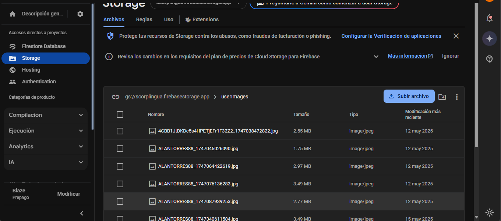

# DatabaseMethods

Esta clase proporciona métodos para interactuar con Firebase Firestore dentro de GoyoLingua, este es una de las cosas más importantes ya que aquí establecemos funciones para añadir usuarios, obtener usuarios, subir imagenes, actualizar usuarios y entre otras cosas que se ocupan dentro de este proyecto

## Métodos de Gestión de Usuarios

### `addUser(Map<String, dynamic> userInfoMap, String id)`
- **Descripción**: Añade un nuevo usuario a la colección "users" en Firestore.
- **Parámetros**:
  - `userInfoMap`: Mapa con la información del usuario.
  - `id`: Identificador único del usuario.
- **Retorno**: Future que completa la operación.

### `getUserById(String uid)`
- **Descripción**: Obtiene los datos de un usuario específico mediante su ID.
- **Parámetros**:
  - `uid`: Identificador único del usuario.
- **Retorno**: Future con el DocumentSnapshot que contiene los datos del usuario.

### `subirImagenUsuario(File imagen, String userId)`
- **Descripción**: Sube la imagen de perfil de un usuario a Firebase Storage.
- **Parámetros**:
  - `imagen`: Archivo de imagen a subir.
  - `userId`: Identificador único del usuario.
- **Retorno**: Future con la URL de descarga de la imagen o null si ocurre un error.

### `updateUser(String username, String urlImageNew)`
- **Descripción**: Actualiza la foto de perfil de un usuario.
- **Parámetros**:
  - `username`: Nombre de usuario.
  - `urlImageNew`: Nueva URL de la imagen de perfil.
- **Retorno**: Future que completa la operación.

## Métodos de Búsqueda

### `Search(String username)`
- **Descripción**: Busca usuarios por la primera letra de su nombre de usuario.
- **Parámetros**:
  - `username`: Nombre de usuario para buscar.
- **Retorno**: Future con QuerySnapshot que contiene los resultados de la búsqueda.

## Métodos de Chat

### `addMessage(String chatRoomId, String messageId, Map<String, dynamic> messageInfoMap)`
- **Descripción**: Añade un mensaje a una sala de chat específica.
- **Parámetros**:
  - `chatRoomId`: Identificador de la sala de chat.
  - `messageId`: Identificador único del mensaje.
  - `messageInfoMap`: Mapa con la información del mensaje.
- **Retorno**: Future que completa la operación.

### `createChatRoom(String chatRoomId, Map<String, dynamic> chatRoomInfoMap)`
- **Descripción**: Crea una nueva sala de chat si no existe.
- **Parámetros**:
  - `chatRoomId`: Identificador de la sala de chat.
  - `chatRoomInfoMap`: Mapa con la información de la sala de chat.
- **Retorno**: Future con true si la sala ya existía o la referencia a la nueva sala creada.

### `getChatRoom(chatRoomId)`
- **Descripción**: Verifica si existe una sala de chat específica.
- **Parámetros**:
  - `chatRoomId`: Identificador de la sala de chat.
- **Retorno**: Future con un booleano (true si existe, false si no).

### `getChatRoomMessages(chatRoomId)`
- **Descripción**: Obtiene los mensajes de una sala de chat ordenados por tiempo descendente.
- **Parámetros**:
  - `chatRoomId`: Identificador de la sala de chat.
- **Retorno**: Future con un Stream de QuerySnapshot que contiene los mensajes.

## Métodos para Gestión de Profesores y Estudiantes

### `getAllTeachers()`
- **Descripción**: Obtiene todos los usuarios que son maestros.
- **Retorno**: Future con un Stream de QuerySnapshot que contiene todos los maestros.

### `getAllStudents()`
- **Descripción**: Obtiene todos los usuarios que son estudiantes.
- **Retorno**: Future con un Stream de QuerySnapshot que contiene todos los estudiantes.

## Métodos para Gestión de Lecciones

### `obtenerTodasLasLecciones()`
- **Descripción**: Obtiene todas las lecciones disponibles en la colección "clases".
- **Retorno**: Future con una lista de pares clave-valor donde la clave es el ID del documento y el valor es un objeto Leccion.

### `obtenerLeccion(String id)`
- **Descripción**: Obtiene una lección específica por su ID.
- **Parámetros**:
  - `id`: Identificador único de la lección.
- **Retorno**: Future con un objeto Leccion.
- **Excepciones**: Lanza una excepción si la clase no existe.
