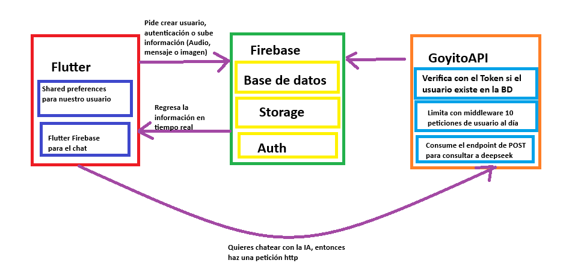
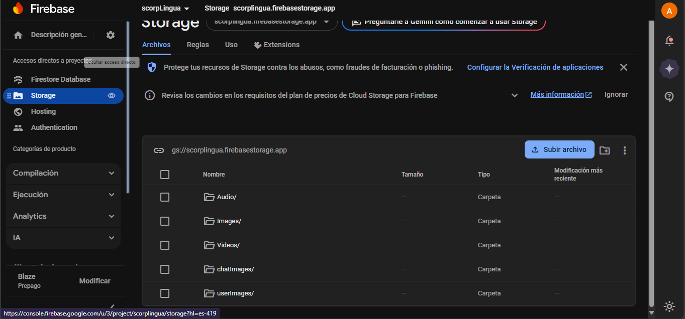
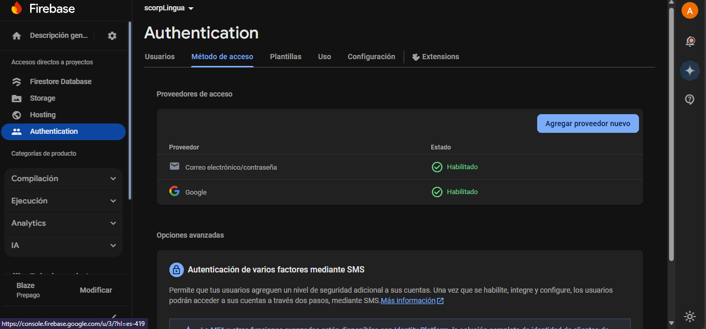

# 🇬🇧📱 GoyoLingua

## 👋 ¿Qué somos?

Somos una comunidad de estudiantes de la **FES Aragón** dedicados a brindar apoyo a nuestros compañeros en el aprendizaje de lenguas extranjeras, comenzando con el idioma **inglés**.  
🎓 GoyoLingua nace del deseo de crear una herramienta de **estudiantes para estudiantes**: accesible, intuitiva y centrada en nuestras necesidades reales.

---

## 🎯 ¿Cuál es el objetivo de nuestro proyecto?

El objetivo de **GoyoLingua** es **fomentar el aprendizaje autónomo** del idioma inglés fuera del contexto académico formal.  
Queremos que los estudiantes tengan a la mano una herramienta que les permita:

✅ Reforzar conocimientos previos.  
✅ Aprender inglés desde cero.  
✅ Practicar libremente y a su ritmo.  
✅ Sentirse acompañados incluso cuando no hay profesores disponibles.

> 🧠 ¡Queremos que aprender inglés sea algo opcional, divertido y accesible!

---

## 🌍 Alcance de la aplicación

Por ahora, **GoyoLingua** estará disponible **exclusivamente para la comunidad de la FES Aragón**.  
Queremos que esta aplicación sea **única y personalizada para nuestra facultad**, diseñada con cariño por y para nosotros.

> En el futuro, podríamos considerar expandirnos, pero nuestro enfoque actual es 100% local ❤️.

---

## 🛠️ ¿Cómo lo vamos a lograr?

La arquitectura de **GoyoLingua** se basa en tres grandes pilares:

---

### 🎨 Frontend — Flutter

Construido con **Flutter**, el frontend será el corazón visual de la app.

📲 Funciones clave:
- Navegación y rutas.
- Pantallas para clases, ejercicios y chats.
- Integración con Firebase para autenticación y datos.
- Experiencia responsiva en Android y iOS.

---

### ☁️ Firebase — Nuestra nube todo en uno

Usaremos **Firebase** para manejar:

🔐 Autenticación de usuarios  
📚 Base de datos en tiempo real (FireStore)  
📦 Almacenamiento de archivos (audios, imágenes, recursos)  
🔒 Seguridad mediante reglas y roles

> Firebase nos permite enfocarnos en lo que importa: enseñar, sin complicaciones técnicas.

---

### ⚙️ Backend — Potenciado con IA

Aunque mucho lo resolvemos con Flutter y Firebase, también usaremos un pequeño pero poderoso **backend**.  
Este tendrá una **API privada** conectada con **OpenAI**, donde procesaremos:

🗣️ Ejercicios de expresión oral  
📝 Corrección de textos y explicaciones gramaticales  
🤖 Chat con IA educativa (¡pregunta y aprende!)  
🔐 Manejo seguro de nuestras API keys

**Link de nuestro backend**
- [GoyoLinguaAPI](https://github.com/SCORPIONALAN/GoyoLinguaAPI)
> Todo esto se procesa en el servidor, y el frontend solo recibe respuestas optimizadas 💡

#### Backend Corriendo en render
 
---

## 🧩 Arquitectura General

Nuestra arquitectura puede verse como una especie de **microservicios**, donde cada componente tiene una función clara:

- **Frontend (Flutter)**: Interfaz y experiencia de usuario.
- **Firebase**: Gestión de datos, autenticación y almacenamiento.
- **Backend (API + DeepSeek)**: Procesamiento intensivo, correcciones, ejercicios conversacionales.

**¿Qué ventajas tiene nuestra arquitectura?**
🧩 Modularidad  
🔁 Escalabilidad  
🛡️ Seguridad  
🧼 Mantenimiento limpio

---

## 🏗️Arquitectura de todo el proyecto
- [Inicio sesion](./DOC/componentes/onBoarding/autenticacion.md)
- [Pagina para completar el inicio de sesion](./DOC/componentes/onBoarding/completar.md)
- [Pagina Main de las lecciones](./DOC/componentes/Lecciones/homePage.md)
- [Widgets de nuestras Lecciones](./DOC/componentes/Lecciones/carga_muestra_leccion.md)
- [Pagina de inicio de nuestro chat](./DOC/componentes/chat_inicio/chatHomePage.md)
- [Widgets de nuestra pagina de inicio del chat](./DOC/componentes/chat_inicio/widgetsHomePAge.md)
- [Pagina de chat personalizada](./DOC/componentes/chat_main/chat.md)
- [Inteligencia Artificial](./DOC/componentes/GoyitoIA/goyitoIA.md)
- [Perfil (subir imagenes cerrar sesión)](./DOC/componentes/perfil/perfil.md)
- [Navegador para enrutamientos](./DOC/componentes/navegador/navegador.md)
- **Utils**
- [Funciones para base de Datos](./DOC/componentes/utils/base_de_datos.md)
- [Shared Preferences](./DOC/componentes/utils/shared_preferences.md)
- **Dependencias**
- [Dependencias que usamos en el proyecto](./DOC/componentes/dependencias/dependencias.md)
---
## Arquitectura general de la APP

---
## Arquitectura del frontend con el backend

---
## Capturas de la base de datos

### Base de datos

## 📘 Bitácora del proyecto

- [Día 1: GoyoLingua Definición del proyecto y Creación de Pantallas(UI) (Alan)](./DOC/bitacora1.md)
- [Día 2: GoyoLingua Inicio de sesión / Navegador / HomeChat / Chat Personal / Home de targetas / Perfil (Alan)](./DOC/bitacora2.md)
- [Día 3: Corrección de LogOut y documentacion (Valeria)](./DOC/bitacora3.md)
- [Día 3: GoyoLingua descripcion y corrección de GoyitoIA (Miguel)](./DOC/bitacora4.md)
- [Día 3: GoyoLingua HomePageTeoria y Widgets nuestros (Leonardo)](./DOC/bitacora5.md)
- [Día 4: GoyoLingua Documentación de nuestro chat explicandolo detalle por detalle (Ricardo)](./DOC/bitacora6.md)
- [Día 4: GoyoLingua Explicacion de ChatInicio y de navegador](./DOC/bitacora7.md)
---
## 🚀 ¡Únete a GoyoLingua!

Gracias por ser parte de este proyecto que busca revolucionar el aprendizaje del inglés en nuestra facultad.  
🌟 **Juntos aprendemos aprendemos mejor**
    **Together we learn better!**

---

## 😞 Que cosas no cumplimos

El desarrollo de GoyoLingua fue muy extenso debido a los diversos cursos que tomamos como participantes de este proyecto. Logramos muchos avances importantes, pero no logramos crear ejercicios para los usuarios ni crear sus estadisticas. Contemplamos en un futuro hacer eso y que realemente esta app este en su máximo explendor.
De igual forma por seguir tutoriales nos atascabamos muy seguido y no por eso no podiamos escalar el código como queriamos

---
## Posibles Errores
Tuvimos problemas con la camara, por lo que tuvimos que quitarla, de igual forma desconocemos porque puede llegar a fallar el seleccionado de la imagen, por lo que pedimos que si sucede un error ahí vuelva a intentar subir esa imagen.

---

## Material de referencias

- [🔥📱 Ultimate Chat App with Flutter Firebase | Full Tutorial for Beginners 2025](https://www.youtube.com/watch?v=TWUeE6kz3Lo&t=11437s&ab_channel=ShivamGupta)

- [Login & Sign up | Email & password Auth | Flutter Firebase integration | Authentication](https://www.youtube.com/watch?v=7seYBGMPf84&list=PLEFAsRdcqVXet8G5szQEZL0lMZ9zldGHd&ab_channel=FlutterFly)

- [Flutter Tutorial - Add Custom Fonts & Google Fonts](https://www.youtube.com/watch?v=Gf-cyiWlmEI&ab_channel=HeyFlutter%E2%80%A4com)

- [Creating Custom Theming in Flutter Apps | Styling Flutter widgets based on Theme Data](https://www.youtube.com/watch?v=pdEs7BFl49E&ab_channel=vijaycreations)

- [How to integrate Rest API in Flutter Application](https://www.youtube.com/watch?v=p29G-GVzm8g&list=PL7zgwanvi8_OvGhdNt1pwvN2luynjiH1V&index=6&ab_channel=SnippetCoder)

- [Flutter - Móvil: De cero a experto](https://www.udemy.com/course/flutter-cero-a-experto/?srsltid=AfmBOoq3baiRwLIhldMOxdUxOP8pJenZnOCUv3bJUi8eQ5ImgTNDtKOE) 